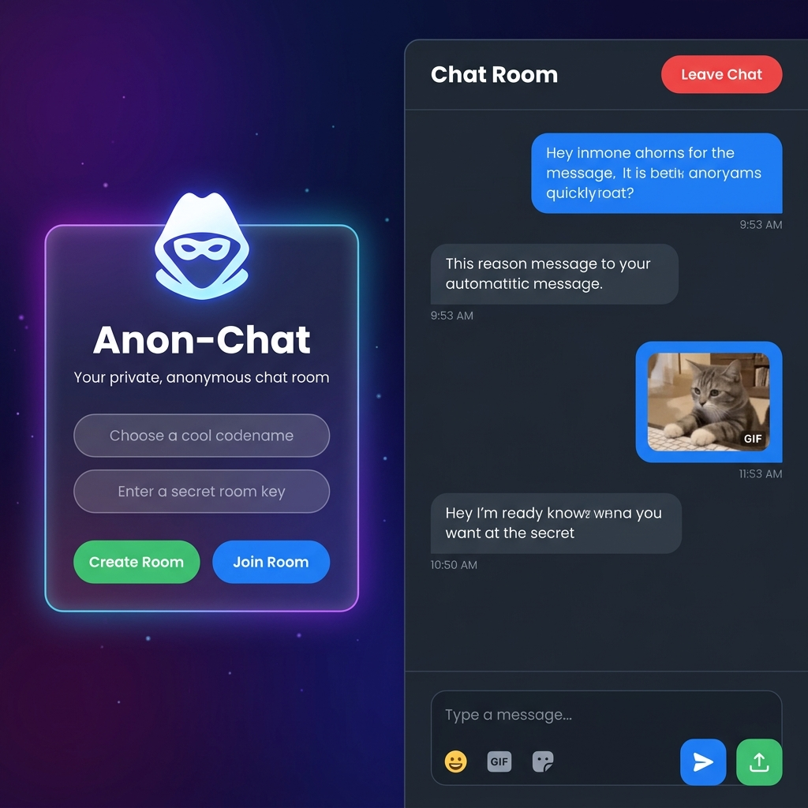

# 🕵️ Anon-Chat

> **Private. Real-time. Anonymous.**  
> A secret-key based anonymous chat room application built with Node.js, Socket.IO, and TailwindCSS.



---

## ✨ Features

- 🔐 **Secret Room Keys** — Create or join rooms using a unique key, no sign-up required
- 👤 **Anonymous Identities** — Pick any codename you like
- ✅ **Admin Approval Flow** — Room creator approves/denies join requests
- 💬 **Real-time Messaging** — Instant chat powered by Socket.IO
- 😀 **Emoji Picker** — Quickly react with emojis
- 🎞️ **GIF Search** — Search and send GIFs via Giphy API
- 🗒️ **Sticker Support** — Send fun stickers in chat
- 📁 **File Uploads** — Share files directly in the chat room
- 👑 **Auto Admin Promotion** — If admin disconnects, the next user is promoted
- 🌌 **Beautiful UI** — Glassmorphism design with animated gradient background

---

## 🚀 Getting Started

### Prerequisites

- [Node.js](https://nodejs.org/) v14 or higher
- npm

### Installation

```bash
# 1. Clone the repository
git clone https://github.com/your-username/Aviothic2.0_codeforgers.git
cd Aviothic2.0_codeforgers

# 2. Install dependencies
npm install

# 3. Build TailwindCSS
npm run build

# 4. Start the server
npm start
```

Then open your browser and navigate to:  
👉 **http://localhost:3000**

---

## 🛠️ Tech Stack

| Layer | Technology |
|-------|-----------|
| **Runtime** | Node.js |
| **Server** | Express 4.x |
| **Real-time** | Socket.IO 4.x |
| **File Uploads** | Multer |
| **Styling** | TailwindCSS 3.x |
| **Icons** | Font Awesome 6 |
| **Fonts** | Google Fonts – Poppins |
| **GIF API** | Giphy |

---

## 📁 Project Structure

```
Aviothic2.0_codeforgers/
├── public/
│   ├── index.html       # Main UI (join + chat screens)
│   ├── script.js        # Frontend logic & socket events
│   ├── style.css        # Tailwind source
│   └── output.css       # Compiled Tailwind CSS
├── uploads/             # Uploaded files (auto-created)
├── server.js            # Express + Socket.IO server
├── package.json
├── tailwind.config.js
└── postcss.config.js
```

---

## 📡 Socket.IO Events

| Client → Server | Server → Client | Description |
|----------------|----------------|-------------|
| `create-room` | `room-created` / `room-exists` | Create a keyed room |
| `join-room` | `join-request-sent` / `room-not-found` | Request to join |
| `approve-join` | `join-approved` | Admin approves user |
| `deny-join` | `join-denied` | Admin denies user |
| `chat-message` | `chat-message` | Send a message |
| `file-uploaded` | `file-uploaded` | Announce uploaded file |
| `leave-room` | `user-left` | User leaves room |

---

## 🧑‍💻 Scripts

| Command | Description |
|---------|-------------|
| `npm start` | Start the server on port 3000 |
| `npm run build` | Compile TailwindCSS |

---

## ⚙️ Environment

The app runs on **port 3000** by default. You can override it with an environment variable:

```bash
PORT=8080 npm start
```

---

## 📄 License

ISC © [Aviothic / Codeforgers](https://github.com/your-username)